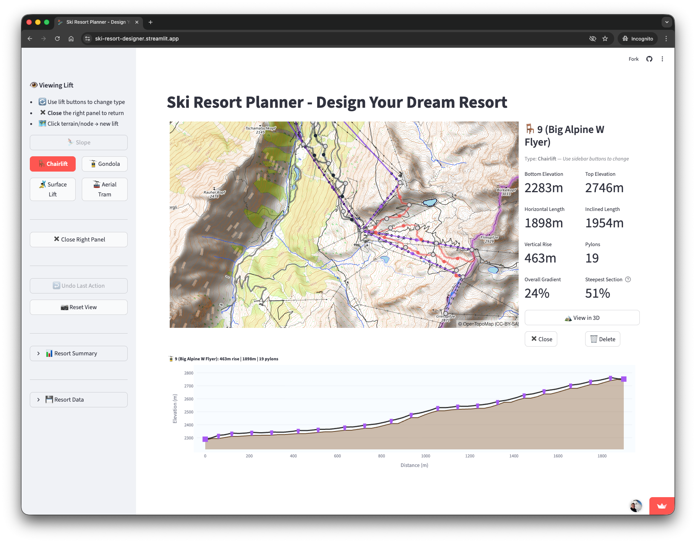

# Ski Resort Planner

Design ski resorts on real terrain with an addictive, game-like interface.



## Installation Guide (macOS)

You've cloned the repository and opened the folder in Terminal. Follow these steps to run the app.

### Step 1: Create a Python Virtual Environment

A virtual environment keeps this project's dependencies separate from other Python projects:

```bash
python3.11 -m venv ".venv-skiresort"
source ".venv-skiresort/bin/activate"
```

### Step 2: Install Dependencies

```bash
pip install -r requirements.txt
```

### Step 3: Run the Application

```bash
streamlit run skiresort_planner/app.py
```

The app opens automatically at http://localhost:8501

On first launch, the terrain data (~285MB) is automatically downloaded from [Hugging Face](https://huggingface.co/datasets/MichaelMedek/alps_eurodem). This only happens once - subsequent runs use the cached local copy.

To stop the server, press `Ctrl+C` in your terminal.

### Running Again Later

```bash
source ".venv-skiresort/bin/activate"
streamlit run skiresort_planner/app.py
```

---

## Terrain Data

The app uses pre-cropped Alps DEM (Digital Elevation Model) data covering the European Alps at 60m resolution. The data is automatically downloaded from Hugging Face on first run.

For other regions, download the full 2.3GB EuroDEM from https://www.mapsforeurope.org/datasets/euro-dem and use `scripts/crop_dem_to_alps.py` as a template.

---

## Documentation

Detailed documentation  about how to use the app UI and the underlying algorithms is available in the `docs/` folder:

| Document | Contents |
|----------|----------|
| [User Guide](docs/DETAILS_UI.md) | How to use the application |
| [Technical Reference](docs/DETAILS.md) | Architecture and algorithms |
