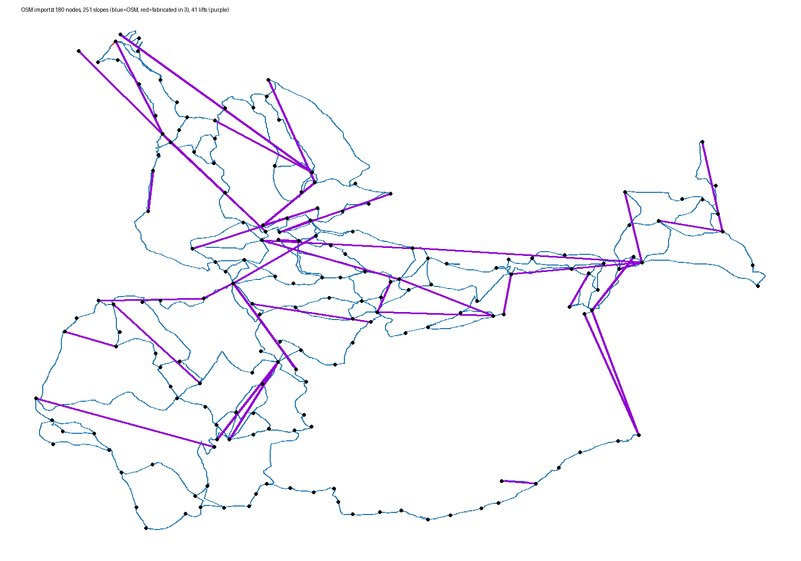

# 🏔️ Technical Reference: Alpin Architect

This document contains the complete **mathematical foundation** and **algorithm methodology** for ski resort planning. It serves as a technical backup documenting how paths and lifts are generated.

For user workflow, see [DETAILS_UI.md](DETAILS_UI.md).

---

## Table of Contents

1. [Core Helper Functions](#1-core-helper-functions)
2. [Terrain Gradient Calculation](#2-terrain-gradient-calculation)
3. [Traverse Physics](#3-traverse-physics-the-core-relationship)
4. [Civil Engineering: Earthwork](#4-civil-engineering-earthwork--excavation)
5. [Path Generation Algorithm](#5-path-generation-algorithm)
6. [Difficulty Classification](#6-difficulty-classification)
7. [Custom Direction / Connect Paths](#7-custom-direction--connect-paths)
8. [Lift Pylon Placement](#8-lift-pylon-placement)
9. [OpenStreetMap Import](#9-openstreetmap-import)
10. [Node Editing: Merge / Delete / Insert](#10-node-editing-merge--delete--insert)

---

## 1. Core Helper Functions

These functions read from the DEM (Digital Elevation Model) and are used throughout the path planning algorithm.

### 1.1 Elevation lookup: $(lon, lat) \to z$

Returns the elevation in metres at the given coordinates, or **undefined** if the point is outside the DEM bounds or in a no-data area.

**Method:** Direct single-cell lookup from the DEM grid — no interpolation or multi-point sampling. The coordinate is transformed to the DEM's native projection, converted to grid indices, and the value at that cell is returned.

### 1.2 Terrain gradient: $(lon, lat) \to (S_{\text{terrain}}, \theta_{\text{fall}})$

Returns:
- $S_{\text{terrain}}$: Terrain steepness as percentage
- $\theta_{\text{fall}}$: Fall line bearing (direction of steepest descent, 0°=North)

**Method:** Uses **weighted multi-point sampling** (16 elevation lookups around the center point) to reduce DEM noise. See Section 2 below.

---

## 2. Terrain Gradient Calculation

### 2.1 The Problem: DEM Grid Noise

A 60m Digital Elevation Model (DEM) has inherent noise. A single elevation difference can give misleading slope values. We use **weighted multi-point sampling** to get robust terrain measurements.

> **Note:** This approach is inspired by the ArcGIS Surface Parameters tool, which recommends larger neighborhoods over the traditional 3×3 Horn algorithm for noisy terrain.

### 2.2 Weighted Gradient Calculation ("Magic 8")

We sample elevations $z_i$ at 8 compass bearings on two concentric rings (the step size is ≈ 30 m):
- **Inner Ring ($r_1 = 0.5 \times$ step $\approx 15\text{ m}$):** Weight $w_{\text{inner}} = 2$
- **Outer Ring ($r_2 = 1.0 \times$ step $\approx 30\text{ m}$):** Weight $w_{\text{outer}} = 1$

For each sample point $i$ at bearing $\phi_i$, calculate the slope from center **as a percentage**:
```math
slope_i = \frac{z_{\text{center}} - z_i}{d_i} \times 100
```

Positive = downhill from center, negative = uphill.

Decompose into East-West and North-South gradient components (percentage-valued, since $slope_i$ is):
```math
\frac{\partial z}{\partial x} \approx \frac{1}{\sum w} \sum_{i=1}^{n} (slope_i \cdot \sin(\phi_i) \cdot w_i)
```
```math
\frac{\partial z}{\partial y} \approx \frac{1}{\sum w} \sum_{i=1}^{n} (slope_i \cdot \cos(\phi_i) \cdot w_i)
```

### 2.3 Output Values

The **gradient magnitude** is already the steepness percentage (its components are in percent):
```math
S_{\text{terrain}} = \sqrt{\left(\frac{\partial z}{\partial x}\right)^2 + \left(\frac{\partial z}{\partial y}\right)^2}
```
**Fall Line Bearing** (direction of steepest descent, 0°=North):
```math
\theta_{\text{fall}} = \text{atan2}\left(\frac{\partial z}{\partial x}, \frac{\partial z}{\partial y}\right)
```

> **Source:** Based on principles from **Zevenbergen & Thorne (1987)** and **Horn (1981)**. See [ArcGIS: How Slope Works](https://pro.arcgis.com/en/pro-app/latest/tool-reference/spatial-analyst/how-slope-works.htm)

---

## 3. Traverse Physics: The Core Relationship

### 3.1 The Three Slopes

When a skier traverses across a slope, three distinct gradients are involved:

| Slope | Symbol | Description |
|-------|--------|-------------|
| **Terrain Slope** | $S_{\text{terrain}}$ | Natural mountain steepness (measured from DEM) |
| **Effective Slope** | $S_{\text{eff}}$ | What the skier actually experiences (design target) |
| **Side Slope** | $S_{\text{side}}$ | Cross-slope perpendicular to ski direction |

### 3.2 The Fundamental Equations

Given a **traverse angle** $\theta$ (offset from fall line):

**Effective Slope** (component in ski direction):
```math
S_{\text{eff}} = S_{\text{terrain}} \cdot \cos(\theta)
```

**Side Slope** (component perpendicular to ski direction):
```math
S_{\text{side}} = S_{\text{terrain}} \cdot \sin(\theta)
```

These satisfy the Pythagorean identity:
```math
S_{\text{eff}}^2 + S_{\text{side}}^2 = S_{\text{terrain}}^2
```

**Intuition:**
- $\theta = 0°$: Skiing straight down the fall line → $S_{\text{eff}} = S_{\text{terrain}}$, $S_{\text{side}} = 0$
- $\theta = 90°$: Skiing perpendicular (contouring) → $S_{\text{eff}} = 0$, $S_{\text{side}} = S_{\text{terrain}}$
- $\theta > 90°$: Tilting back **against** the fall line → $S_{\text{eff}} < 0$ (a climb)

### 3.3 Calculating Traverse Angle from Target

The designer sets a **signed target effective slope** ($S_{\text{target}}$) for each path. The algorithm calculates the required traverse angle from the **signed** ratio, so one formula spans descend/contour/climb:

```math
\theta = \arccos\left(\frac{S_{\text{target}}}{S_{\text{terrain}}}\right)
```

Because $\arccos$ ranges over $[0°, 180°]$: a positive target gives $\theta < 90°$ (tilt toward the fall line, descend), zero gives $\theta = 90°$ (contour), and a negative target gives $\theta > 90°$ (tilt against the fall line, climb). The reference bearing is **always** the fall line — direction is carried entirely by $\theta$.

### 3.4 Difficulty Thresholds

| Difficulty | Effective Slope Range |
|------------|----------------------|
| 🟢 Green | 0% – 15% |
| 🔵 Blue | 15% – 25% |
| 🔴 Red | 25% – 40% |
| ⚫ Black | 40%+ |

### 3.5 Example: Blue Run on Black Terrain

- Terrain: $S_{\text{terrain}} = 50\%$ (Black-rated natural slope)
- Target: $S_{\text{target}} = 22\%$ (Blue difficulty)

Calculate traverse angle:
```math
\theta = \arccos\left(\frac{22}{50}\right) = \arccos(0.44) \approx 64°
```

The resulting side slope:
```math
S_{\text{side}} = 50 \cdot \sin(64°) \approx 45\%
```

The skier experiences a comfortable 22% slope, but the cross-slope is 45% — requiring significant earthwork.

---

## 4. Civil Engineering: Earthwork & Excavation

### 4.1 Side Slope Creates a Cross-Section Problem

When traversing, the natural terrain slopes perpendicular to the ski direction. To create a level piste:
- **Excavate** (cut) on the uphill/inner side
- **Fill** on the downhill/outer side

```
                    CROSS-SECTION VIEW

        Original Terrain Surface
              ╲
               ╲    ← Inner edge (excavate below terrain)
                ╲
             I───●───I     ← Planned Centerline (on terrain)
                  ╲
                   ╲  ← Outer edge (fill above terrain)
                    ╲
```

### 4.2 The Belt Model

A ski piste has a physical width called the **Belt**. The path is planned along the **centerline** of this belt.

Belt width is calculated adaptively from side slope to keep excavation within limits:

```math
W = \frac{H_{\text{threshold}} \cdot 200}{S_{\text{side}}}
```

Where $H_{\text{threshold}} = 2.5\text{m}$ is the maximum acceptable excavation depth. $W$ is then **clamped to difficulty-specific minimum and maximum widths**; on nearly-flat terrain ($S_{\text{side}} < 1\%$) the maximum width is used to avoid division by near-zero.

For steeper side slopes, the belt narrows to reduce excavation. For gentler side slopes, a wider belt can be used.

### 4.3 Vertical Cut/Fill Depth

**Vertical displacement** at edge (cut or fill depth):
```math
H_{\text{edge}} = \frac{S_{\text{side}}}{100} \cdot \frac{W}{2} = \frac{S_{\text{side}} \cdot W}{200}
```

- **Inner edge:** Excavated $H_{\text{edge}}$ meters below original terrain
- **Outer edge:** Filled $H_{\text{edge}}$ meters above original terrain

### 4.4 🚜 Side Cut Warning

A warning is triggered when the side slope exceeds what even the **minimum** belt width for that difficulty can handle:

```math
S_{\text{side}} > \frac{H_{\text{threshold}} \cdot 200}{W_{\text{min}}}
```

$W_{\text{min}}$ is difficulty-specific, so the trigger is too: green ($W_{\text{min}}=10$m) warns above **50%**, blue/black ($20$m) above **25%**, red ($25$m) above **20%**. Beyond it, excavation would exceed 2.5m even at the narrowest allowed belt.

### 4.5 📐 Too Flat Warning

When terrain is gentler than the minimum skiable slope:

```math
S_{\text{avg}} < 5\% \implies \text{Too Flat Warning}
```

### 4.6 🌉 Bridge / 🚇 Tunnel

A finished deck floats off terrain past a threshold (**50 m**): above → bridge, below → tunnel (an exact above/below tie → bridge).

### 4.7 Key Insight: Any Terrain Can Be Skied

**Side slope can always be excavated away.** There is no terrain too steep for any difficulty level — the excavator simply does more work. However:
- High side slope = massive cross-slope earthwork
- The warnings alert designers to reconsider the route

---

## 5. Path Generation Algorithm

### 5.1 Core Principle

The tracer holds a **signed target grade** and follows the terrain:
1. **Fixes the target grade** (what the traveller experiences) — its **sign** sets the direction along the path's length: positive **descends** the fall line, negative **climbs** against it, zero **contours** across it.
2. **Dynamically calculates the traverse angle** at each step from the **signed** grade ratio (§3.3), so a single $\arccos$ over $[0°, 180°]$ covers descending, contouring, and climbing off one fixed reference (the fall line).

This allows routes to **naturally curve around terrain features**. Ski **slopes** always descend, so they use positive targets (§5.2). **Roads** may descend, climb, or run flat, so they use the signed green targets (§7.3). A contour (zero target) drives the traverse angle to ~90°, tracing across the slope at near-constant elevation.

### 5.2 Target Effective Slopes

| Difficulty | Gentle Target | Steep Target | Threshold Range |
|------------|---------------|--------------|-----------------|
| 🟢 Green | 7% | 12% | 0–15% |
| 🔵 Blue | 17% | 22% | 15–25% |
| 🔴 Red | 28% | 37% | 25–40% |
| ⚫ Black | 45% | 60% | 40%+ |

> Targets are set 2-3% inside threshold bounds to prevent misclassification.

### 5.3 Path Variants Per Difficulty

| Variant | Side | When Generated |
|---------|------|----------------|
| Left-Gentle/Steep | Left of fall line | When gentle/steep target < terrain slope |
| Right-Gentle/Steep | Right of fall line | When gentle/steep target < terrain slope |
| Center-Gentle/Steep | Straight down | When gentle/steep target ≥ terrain slope |

### 5.4 Center-Stop Rule

Generate paths in order from easiest to hardest target, stopping after **4 center paths** are created:

1. 🟢 Gentle Green (7%)
2. 🟢 Steep Green (12%)
3. 🔵 Gentle Blue (17%)
4. 🔵 Steep Blue (22%)
5. 🔴 Gentle Red (28%)
6. 🔴 Steep Red (37%)
7. ⚫ Gentle Black (45%)
8. ⚫ Steep Black (60%)

**Why?** Center paths all follow the same fall line, so additional ones are redundant.

**Note:** When designing a fan of paths from a node, the generation always loops through all 8 variants from flat to steep, and during each steepness target level it will generate either left and right or only a center path depending on terrain slope.

### 5.5 Cumulative Drop Tracking (Feedback Loop)

**Problem:** DEM grid resolution (60m) causes mismatch between gradient predictions and actual elevation changes.

**Solution:** Track cumulative elevation drop and dynamically adjust each step's target.

**Pre-calculate at initialization:**
```math
\text{targetTotalDrop} = \frac{S_{\text{target}}}{100} \times L_{\text{target}}
```

**At each step:**
1. $\text{remainingDrop} = \text{targetTotalDrop} - \text{accumulatedDrop}$ (signed)
2. $\text{remainingDistance} = L_{\text{target}} - d_{\text{total}}$
3. $S_{\text{step}} = \frac{\text{remainingDrop}}{\text{remainingDistance}} \times 100$

$S_{\text{step}}$ carries the **sign** of the target. It is clamped to a band that keeps the step running the target's way — a descent step never climbs, a climb step never descends, a contour stays near level: a descent to $[\,0,\; 2.5 \cdot S_{\text{target}}\,]$, a climb to $[\,2.5 \cdot S_{\text{target}},\; 0\,]$, a contour to $[-5\%, +5\%]$ (the minimum-skiable band). The band is floored at **0** (not the 5% minimum), so a run that has drifted too steep can ask for a gentle — even flat — step and pull its average back toward the target.

**Why this works:** The path self-corrects toward the target average without retries. Flooring at 0 (rather than the 5% minimum-skiable) is what lets an over-steep run recover; a 5% floor would trap every step at ≥ 5% and ratchet the average upward.

### 5.6 Step-by-Step Tracing

**Step 1: Sample Local Terrain**

Sample the gradient at the **current point** (the step's start); the cumulative-drop feedback (§5.5) corrects any per-step lag, so no midpoint sampling is needed:
```math
S_{\text{terrain}}, \theta_{\text{fall}} = \textrm{getTerrainGradient}(\text{current point})
```

**Step 2: Calculate Traverse Angle** (from the **signed** grade ratio)

```math
\theta_{\text{traverse}} = \arccos\left(\frac{S_{\text{step}}}{S_{\text{terrain}}}\right)
```

Cases (with $S_{\text{step}}$ **signed**, §3.3):
- $S_{\text{step}} \geq S_{\text{terrain}}$: $\theta = 0°$ (straight down the fall line — a descent at/above terrain steepness)
- $0 < S_{\text{step}} < S_{\text{terrain}}$: $0° < \theta < 90°$ (descending traverse)
- $S_{\text{step}} = 0$ (contour): $\arccos(0) = 90°$ — a traverse across the slope
- $S_{\text{step}} < 0$ (climb): $\theta > 90°$ (tilts against the fall line)
- Clamp to $[2°, 178°]$ (keeps left/right diverging and off exactly straight up/down); $S_{\text{terrain}} = 0$ (flat DEM cell) → $\theta = 90°$

**Step 3: Calculate Step Bearing**

```math
\theta_{\text{step}} = \theta_{\text{fall}} + \text{sign} \cdot \theta_{\text{traverse}} + \epsilon
```

Where:
- $\theta_{\text{fall}}$ is the fall line — **always** the reference; direction (descend/climb) is carried by $\theta_{\text{traverse}}$ crossing 90°, never by flipping the reference
- $\text{sign} = -1$ for Left, $+1$ for Right
- $\epsilon \sim \mathcal{N}(0, \sigma^2)$ is adaptive Gaussian noise

**Adaptive Noise:** Scale noise inversely with traverse angle to prevent Green paths on steep terrain from drifting to Blue (floored at 0, so a climbing step $\theta > 90°$ gets no noise):

```math
\sigma_{\text{adaptive}} = \sigma_{\text{base}} \cdot \max\left(0, \frac{90° - \theta_{\text{traverse}}}{90°}\right)
```

**Step 4: Take Step**

```math
(\text{lon}_{\text{new}}, \text{lat}_{\text{new}}) = \textrm{destinationPoint}(\text{lon}, \text{lat}, \theta_{\text{step}}, \Delta d)
```

Where $\Delta d$ is the step size (default 30m).

**Step 5: Update State**

```math
\text{accumulatedDrop} += z_{\text{current}} - z_{\text{new}}
```

The step drop is **signed**: positive when the step descended, negative when it climbed.

**Step 6: Loop** until $d_{\text{total}} \geq L_{\text{target}}$

### 5.7 Why Paths Curve Around Terrain

The **fall line direction changes** as you move across the mountain:

1. At Point A: $\theta_{\text{fall}} = 180°$ (south)
2. Move 30m to the left
3. At Point B: $\theta_{\text{fall}} = 195°$ (south-southwest)

This creates **natural curving**:
- On convex hills: paths curve outward
- On concave valleys: paths curve inward

### 5.8 Whole-Path Smoothing on Finish

Each segment is spline-smoothed independently at trace time, so two segments meet at a shared junction node with different tangents — a visible **kink**. When a slope or road is **finished**, the whole path is smoothed in one pass: a single cubic B-spline over the full polyline for the horizontal x/y (parametrised by cumulative distance), with elevation from a **monotone (shape-preserving) interpolator** over the same arc length. It is resampled every ≈ 7 m, then re-sliced back to the original segments so the ribbon is continuous across junctions. Finally a **Douglas–Peucker** pass (tolerance ≈ 3.5 m) thins the dense 7 m points on straight runs while keeping them dense through turns.

- The fit is a **weighted least-squares spline**: the boundary **nodes** get a moderately higher weight than the raw planner **corridor points**, with a smoothing budget scaled by the point count. The planner's grid path is a staircase; at a switchback it reverses across sub-metre jitter. A *smoothing* spline averages that jitter into a real turn **radius**. The node weight is deliberately **moderate**: an extreme node weight makes the fit near-singular at the pinned point and manufactures a cusp there.
- **Roads and slopes smooth differently.** Roads use a **higher** smoothing factor — cars need broad, smooth curves and roads accept the earthwork. Slopes use a **lower** one so the ribbon **hugs the terrain** more: skiers are flexible, and a slope should follow the ground rather than build up large cut/fill.
- **Outer endpoints are pinned exactly** (the entity termini, shared with other slopes/lifts/roads). **Internal junctions** are left where the weighted spline places them — about half a metre from the node, shared by value between the two adjacent segments — so the node marker still sits on the ribbon and any node can be a branch point, without snapping a switchback back into a kink.
- Elevation is **interpolated via monotone PCHIP over arc length, never re-queried from the DEM** — it passes through every input elevation without overshoot. A finished deck may therefore float slightly off the ground between nodes — treat it as a bridge / cut / fill.
- Finish smoothing **never rejects** a path and does **not** re-apply the ±15% road cap (§7.3). Rounding a corner can nudge a road's steepest 300 m section; a finished road is allowed to exceed the build cap (bridge/cut/fill).

---

## 6. Difficulty Classification

### 6.1 Segment Classification

When a path is committed, it becomes a segment classified by the **steepest 300m section** (rolling window):

```math
S_{\text{max}} = \max_{\text{window}} \left( \frac{\Delta h_{\text{window}}}{L_{\text{window}}} \right) \times 100\%
```

| Steepest Section | Classification |
|------------------|----------------|
| < 15% | 🟢 Green |
| 15% – 25% | 🔵 Blue |
| 25% – 40% | 🔴 Red |
| ≥ 40% | ⚫ Black |

### 6.2 Slope Classification (Multi-Segment)

The final slope classification is the **steepest section among all segments** at least 100 m long. A short steep section makes the whole slope unskiable for beginners even if the overall average is low.

---

## 7. Custom Direction / Connect Paths

When the automatically generated fan paths don't include the direction you want, just **click the point you want to reach** while building the slope — terrain-adaptive path(s) are routed to that target. Clicking an existing node routes a connector that auto-finishes the slope on commit.

### 7.1 Multi-Grade Path Search

The algorithm tries **8 difficulty-grade targets** (4 difficulties × gentle/steep) to find viable paths:

| Difficulty | Grades | Total |
|------------|--------|-------|
| 🟢 Green | Gentle (7%), Steep (12%) | 2 |
| 🔵 Blue | Gentle (17%), Steep (22%) | 2 |
| 🔴 Red | Gentle (28%), Steep (37%) | 2 |
| ⚫ Black | Gentle (45%), Steep (60%) | 2 |

Unlike the fan tracer (§5.3), the grid-Dijkstra planner has no left/right **side** — it finds the single least-cost route for a target grade, so there are 8 searches, not 16. Similar paths are deduplicated, keeping only the easiest difficulty when paths overlap.

### 7.2 Grid-Based Dijkstra Algorithm

Each path variant uses **Dijkstra's algorithm** (via SciPy's C-optimized implementation) to find terrain-adaptive paths:

**Algorithm Phases:**

1. **Grid Construction:** A metre lattice sized from the **required grade-holding length** $L = 100 \cdot \text{drop} / g$, not the straight distance — a gentle grade on steep ground needs a long serpentine a chord-sized grid would clip. The *along* axis spans the chord (+margin), the *across* axis twice the serpentine's lateral bow $\sqrt{(L/2)^2 - (\text{chord}/2)^2}$. Cell size adapts to $L$ (≈ $L$ / 175, floored near 4 m), coarsening so neither axis exceeds a hard cell cap.

2. **Graph Building:** State = **(node × lateral heading)**, heading ∈ {left, straight, right}. Each node connects to a **radius-9 coprime neighborhood**, not just 8: a planar edge's grade is $S \cdot \cos(\text{bearing-from-fall-line})$, so 8-connectivity offers grades only at 45° steps — too coarse. The wider fan exposes many bearings (e.g. (1,9) ≈ 6° off-contour) so any sub-fall-line target grade can be quantized.

3. **Dijkstra Search:** Least-cost path over the sparse state-graph; the cheapest of the target's three heading sub-states wins.

4. **Smooth:** Cubic-spline smoothed at a **light** factor, resampled at 7 m with elevations re-queried from the DEM. A heavy factor over-rounds the switchback apexes (shortening the path off its grade) and overshoots vertically across gaps (dips below ground).

5. **Quality gate:** A **self-intersecting** smoothed route (over-tight switchback) is rejected — the planner returns nothing and the caller falls back to a straighter alternative.

**Cost Function:**

```math
\text{cost} = d \times \exp\left(\frac{|\text{slope}_{\text{actual}} - \text{slope}_{\text{target}}|}{\sigma}\right) \times P_{\text{against}} \;\;(+\; P_{\text{reversal}})
```

Where:
- $d$ = offset distance. The lattice is uniform, so this is the scalar $\text{res} \cdot \sqrt{dr^2 + dc^2}$ — no per-cell geodesy.
- $\sigma$ = slope-deviation sensitivity (≈ 2; lower = stricter grade matching).
- $P_{\text{against}}$ = 1.0 with the segment's direction, else $\exp(|\text{slope}|/\sigma)$ — a descending segment penalizes climbing, a climbing one penalizes descending. This one-way monotonicity stops looping.
- $P_{\text{reversal}}$ = **lateral momentum**: a heading flip left↔right adds a fixed penalty × cell-size. Without it the search can't tell one clean switchback from a micro-sawtooth of equal cost, which finish-smoothing would flatten back to the too-steep fall line — so it buys **few, large switchbacks**.

Fast (analytic geodesy-free distance + a vectorized graph build → sub-second), terrain-adaptive, and robust (soft penalties absorb DEM noise, no hard cutoffs).

### 7.3 Roads (for cars)

A **Road** is a vehicle road built **segment-by-segment**. Like a slope, a road is routed two ways: a **fan** that radiates candidate routes from the current endpoint (§7.3.1), and **custom-connect** to a clicked target via grid-Dijkstra with a direct-line fallback (§7.3.2). The one road-specific rule is the **±15% hard cap** (§7.3.3).

**Target grade.** A road reuses the **green** slope targets (7% gentle, 12% steep). Because a road may climb, descend, or run flat, the targets are **signed**: descend ($+$), climb ($-$), and a flat contour ($0$).

#### 7.3.1 Road fan

Like the slope fan, the road fan is traced by the gradient-agnostic tracer (§5) from the current endpoint. Its target set is the signed green grades plus a contour:

```math
g_{\text{target}} \in \{+7, +12, -7, -12, 0\}
```

giving up to five spokes (each a left/right traverse, or a center path where the target magnitude meets the terrain steepness). There is no center-stop rule (only five targets). Every spoke is hard-capped at ±15% (§7.3.3); on steep ground the steep-green spokes are filtered out while the gentle and contour spokes survive, so the fan degrades gracefully rather than emptying.

#### 7.3.2 Custom-connect + straight-line fallback

Clicking a target routes to it by the same grid-Dijkstra algorithm and cost function as §7.2, against the signed green $g_{\text{target}}$. A road picks its gradient direction from the endpoints — descending when the target sits lower, climbing when higher — and the monotonicity penalty keeps the segment one-way (no looping), exactly as for a descent-only slope. On gentle ground both targets collapse to one straight route; on steep ground each serpentines, giving two proposals.

If **no** serpentine fits within ±15%, the caller offers a **direct road** (a straight 2-point line, treated as a bridge/cut) — but **only if that direct line itself is within ±15%**. This is the key slope-vs-road difference: a slope's straight-line fallback is *always* offered (any grade is a valid, if steep, run), whereas a road is genuinely **refused** ("Too steep for a car road") when even the direct line is too steep.

#### 7.3.3 ±15% is a HARD cap at build time

The exponential cost term is only a *soft* preference; every road proposal — fan spoke, serpentine, or direct fallback — is additionally **hard-capped** at $g_{\max} = 15\%$ by the caller. Since the steepest-section grade is a magnitude, the cap catches steep climbs and descents alike. A committed road therefore never exceeds the cap.

---

## 8. Lift Pylon Placement

### 8.1 Cable Sag Model

Using normalized position $t = x/L$ where $t \in [0, 1]$:

```math
z_{\text{cable}}(t) = (1-t) \cdot z_0 + t \cdot z_1 - 4 \cdot s \cdot t(1-t)
```

| Variable | Description |
|----------|-------------|
| $z_0$ | Cable elevation at start pylon |
| $z_1$ | Cable elevation at end pylon |
| $s$ | Max sag at midpoint: $s = \textrm{sagFactor} \times L$ |

**Sag Factors:** Typically 5-6% for most lift types, accounting for cable weight and passenger loading.

### 8.2 3-Phase Catenary Algorithm

The physics runs in **distance-space** on a fine uniform internal grid, resampled from the stored terrain so pylon resolution is independent of how coarse that terrain is (uniform at build, thinned on load). Cable anchors sit a fixed **station height** above the terrain at each station.

**Phase 1 — Clearance Violations:**
Recursively find where the cable-to-terrain clearance drops below the **minimum clearance** and place a pylon at the worst violation in each span (subject to a **minimum spacing** between pylons), re-checking the two sub-spans it creates.

**Phase 2 — Max Spacing Enforcement:**
If any span exceeds the **maximum spacing**, insert midpoint pylons until every span is within it.

**Phase 3 — Re-check Clearance:**
Phase-2 pylons reshape adjacent spans, so re-run the Phase-1 clearance check on the new configuration.

(Minimum clearance, minimum/maximum spacing, station height, and sag factor are all per-lift-type parameters.)

---

## 9. OpenStreetMap Import

Two **Import from OpenStreetMap** buttons (sidebar, idle only) fetch the real lifts & pistes in a square area around the map center: **Lifts only** (raw OSM lifts) and **Lifts + slopes** (the connected-graph builder). **Geometry only** — we take the lon/lat polylines and lift stations; elevation, difficulty, pylons, and **belt width** are recomputed by our pipeline. OSM attributes (including `piste:width`) are ignored. Example graph structure our builder produces (slopes blue, lifts purple):



### 9.1 Region + single-query fetch

A **square bounding box**: map center + a half-width slider (0.5–5 km). One lift/piste-only Overpass query is **light** — even a full box returns in seconds.

### 9.2 Mapping OSM → graph

- **Lifts** — only `aerialway` types we map (drag/t-bar/j-bar/platter → surface_lift, chair_lift → chairlift, gondola/mixed_lift → gondola, cable_car → aerial_tram); others ignored. A way with interior `aerialway=station` nodes splits into per-section lifts.
- **Pistes** (Lifts + slopes only) — standard groomed `downhill` + `connection`. The connected-graph builder planar-splits every crossing, merges endpoints/stations into shared hubs (lift-authoritative, no two nodes closer than a minimum hub spacing), DEM-drapes each run on the real OSM line, and groups segments into named slopes. Difficulty comes from the DEM steepest-section grade.

### 9.3 Only full, non-trivial entities; one undoable batch

A way with any vertex outside the box, or over a DEM nodata hole, is skipped whole (never half-imported); skips are logged. Lifts and pistes below a minimum length are dropped as trivial; **Lifts only** also drops unnamed lifts and coincident same-name duplicates. The whole import is a single undoable action — one Undo removes it all.

### 9.4 Idempotent re-import

An incoming run is skipped if the graph already has a slope/lift with the **same two endpoints**.

---

## 10. Node Editing: Merge / Delete / Insert

A finished slope/road is a **chain**: a node sequence $[n_0, \dots, n_N]$ where segment $i$ spans
$n_i \to n_{i+1}$ and adjacent segments share the junction node by value. The three merge-mode edits
rewrite that chain while preserving one invariant — **every segment runs between two distinct existing
nodes and the chain stays connected**. Segment metrics are pure functions of the point polyline, so
reshaping the polyline *is* the edit; each is one undoable action.

### 10.1 Merge

The **survivor** $s$ (first selected) moves to the selection's component-wise **median** position (elevation
re-sampled from the DEM); the others are deleted and every reference repointed to $s$. Refused if the
selection's span (largest pairwise distance) exceeds **500 m** — the median is
only sensible for a tight cluster. Repointing can leave a segment running $s \to s$ (zero-length
"curl"): if the whole entity collapses ($n_0 = n_N$) it is deleted; if only one interior segment does,
that link is dropped from the sequence ($\dots\!\to\!s\!\to\!s\!\to\!\dots$ becomes
$\dots\!\to\!s\!\to\!\dots$) so the chain stays continuous.

### 10.2 Delete

A node is deletable only where removal leaves a valid chain:
- **Interior** (two segments of one path, bounds no path) → the two segments **fuse** (concatenate
  points, drop the shared junction): $n_{i-1}\!\to\!n_i\!\to\!n_{i+1}$ becomes $n_{i-1}\!\to\!n_{i+1}$.
- **Clean endpoint** (one segment, boundary of one *multi-segment* path) → that boundary segment is
  **trimmed** and the terminus re-derived.

Refused otherwise: a **lift station**, a **shared/branch junction** (would split the other path), or a
**sole segment** (would empty the path). Over a multi-node selection the deletions must still leave
**≥ 2 nodes per path**, so an end node *plus* the only interior node of a 2-segment slope is refused
though each is individually deletable. Adjacent interior nodes fuse in one left-to-right pass, so a
trimmed end next to a fused interior never leaves a segment pointing at a deleted node.

### 10.3 Insert

The click is **projected onto the segment centerline** (nearest point on the polyline, density-agnostic — it lands anywhere on the leg, not on a stored vertex), and that projected point becomes the new node with its **elevation DEM-queried** at ground level. The 3D polyline splits at that position (elevation interpolated along the leg) into two segments sharing the new node.
Refused if the projected point is within a step size (**30 m**) of an endpoint — that would stack the new node on an existing one instead of making a real interior split.
