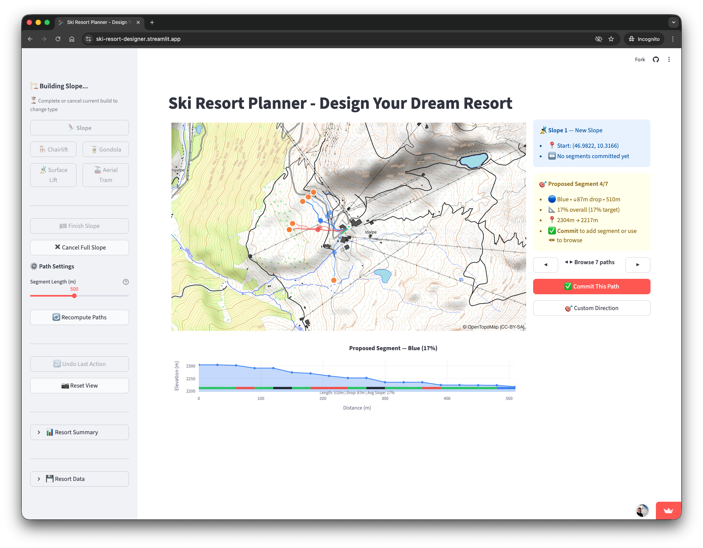
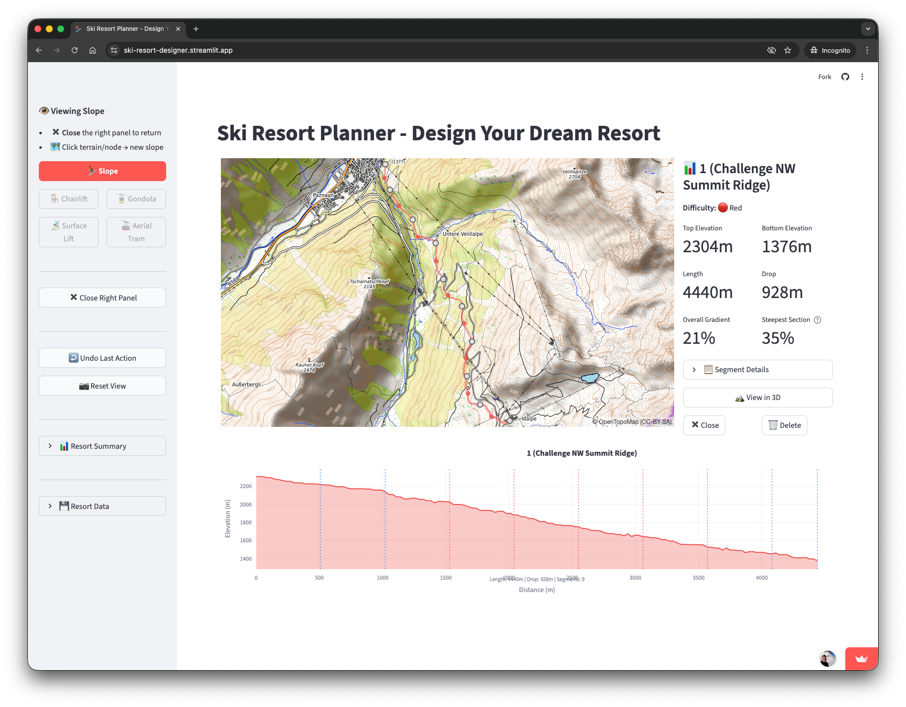
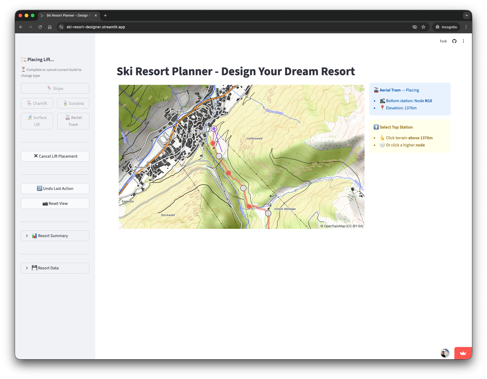
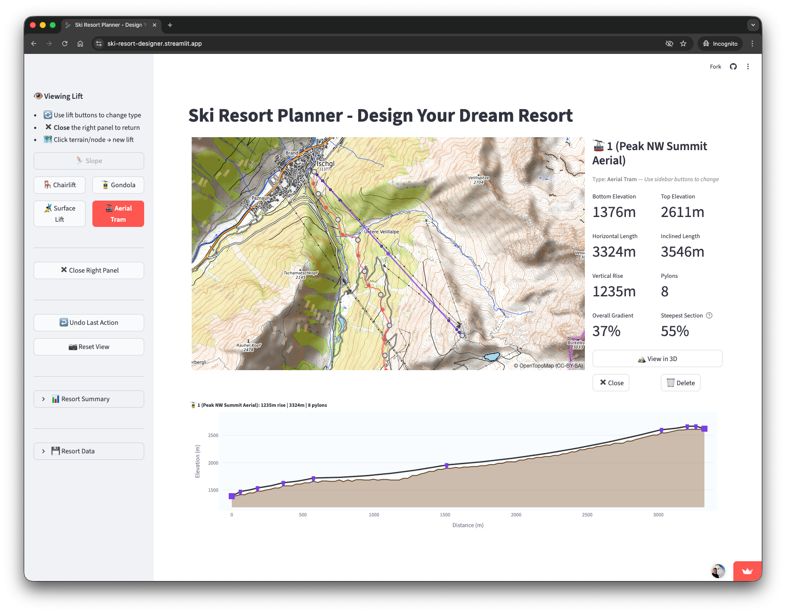
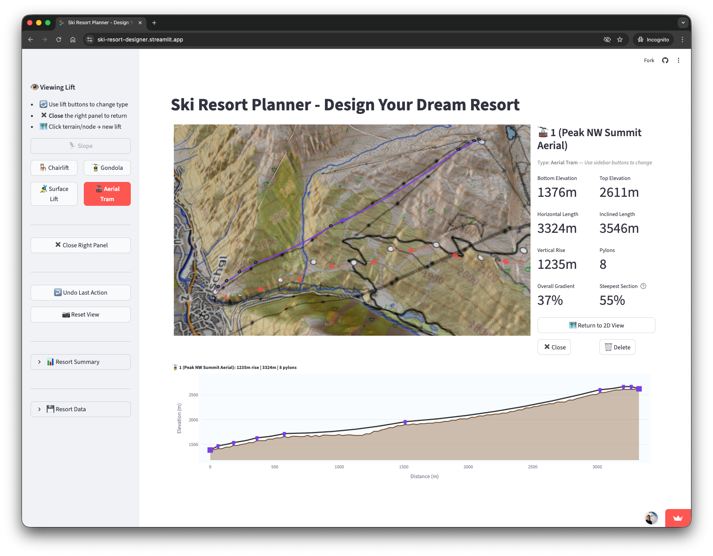
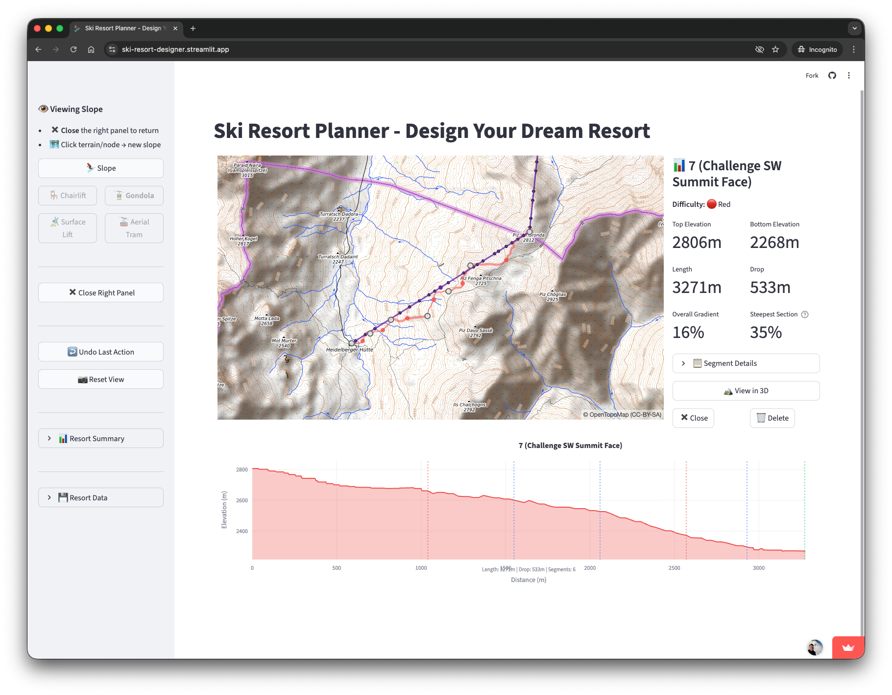

# 🎮 User Guide: Alpin Architect

Design ski resorts on real Alpine terrain with an interactive map-based tool.

> **Technical Reference:** For mathematical details on path generation, traverse physics, and pylon placement algorithms, see [DETAILS.md](DETAILS.md).

---

## Quick Start

1. **Click** on the map to place a starting point → path proposals appear
2. **Click** a dashed line to select it → stats appear in right panel
3. **Click "✅ Commit"** → segment becomes solid, new proposals appear
4. **Click "🏁 Finish Slope"** → slope is complete with a name and difficulty rating

---

## Interface Overview

The interface has three main areas:

| Area | Purpose |
|------|---------|
| **Sidebar (Left)** | Build mode selector, controls, resort stats, save/load |
| **Map (Center)** | Interactive 3D terrain with slopes, lifts, and nodes |
| **Control Panel (Right)** | Path selection, statistics, commit/finish actions |

### Map Elements

| Element | Appearance | Meaning |
|---------|------------|---------|
| **Proposed paths** | Dashed colored lines | Uncommitted path options to choose from |
| **Selected path** | Bold dashed line | Currently highlighted proposal |
| **Committed segments** | Solid colored ribbons | Finalized slope sections |
| **Nodes** | White circles | Junction points (click to start here) |
| **Proposal endpoints** | Orange circles | Click to commit selected path |
| **Lifts** | Purple lines with pylon markers | Ski lifts connecting nodes |
| **Orientation arrows** | Gray arrows | Fall line direction at selection point |

---

## Building Slopes

### Step 1: Start a New Slope

1. Ensure **⛷️ Slope** is selected in the sidebar (highlighted button)
2. Navigate to your desired starting location (pan/zoom the map)
3. **Click on terrain** or an existing **white node** to start
4. Multiple colored path proposals radiate outward from your click

### Step 2: Select and Review a Path

The right panel shows proposal statistics:

| Stat | Description |
|------|-------------|
| **Difficulty** | Color-coded rating based on steepest section |
| **Gradient** | Average slope percentage |
| **Length** | Horizontal distance in meters |
| **Drop** | Vertical descent in meters |
| **Warnings** | Construction alerts (excavation needed, too flat) |

Use the **◀ ▶ arrows** to browse all available paths sorted left-to-right relative to the fall line.

### Step 3: Commit the Path

Two ways to commit:
- Click **"✅ Commit This Path"** button in the right panel
- Click the **orange endpoint marker** directly on the map

The path becomes a solid ribbon, and new proposals appear from the endpoint.

### Step 4: Continue Building

Repeat steps 2-3 to add more segments. The right panel shows cumulative stats:
- Total segments committed
- Current difficulty (based on steepest segment)
- Total drop and length so far

### Step 5: Finish the Slope

Click **"🏁 Finish Slope"** in the sidebar when done.

- The slope receives an auto-generated name
- Final difficulty = the steepest segment's rating
- All segments are unified under one slope entity

---

## Viewing Slope Details

Click on any **finished slope** (the colored ribbon or its icon) to open the statistics panel:

| Metric | Description |
|--------|-------------|
| **Top/Bottom Elevation** | Start and end heights |
| **Length** | Total horizontal distance |
| **Drop** | Total vertical descent |
| **Overall Gradient** | Average slope percentage |
| **Steepest Section** | Maximum gradient in any 300m window (determines difficulty) |

Expand **📋 Segment Details** to see per-segment breakdown with warnings.

### 3D View

Click **"🏔️ View in 3D"** to see the slope from an angled perspective with terrain mesh. Click **"🗺️ Return to 2D View"** to go back.

### Actions

- **✖️ Close** — Return to build mode
- **🗑️ Delete** — Remove the slope (confirms first, can be undone)

---

## Custom Direction

When the auto-generated proposals don't go where you want:

1. Click **"🎯 Custom Direction"** in the right panel
2. Current proposals are hidden
3. **Click anywhere downhill** on the map
4. A path is generated using terrain-adaptive routing

### Connecting to Existing Nodes

If you click **directly on a node marker** (white circle):
- A connection path is generated to that node
- Committing this path **auto-finishes the slope** (creates a junction)

**Constraint:** Target must be within the segment length slider range (default 500m, max 1000m).

---

## Path Generation Details

### How Many Paths?

Up to 16 paths are generated per click (4 difficulties × 2 steepness variants × 2 directions):

| Difficulty | Target Gradients |
|------------|------------------|
| 🟢 Green | 7% (gentle), 12% (steep) |
| 🔵 Blue | 17% (gentle), 22% (steep) |
| 🔴 Red | 28% (gentle), 37% (steep) |
| ⚫ Black | 45% (gentle), 60% (steep) |

On **flat terrain**, fewer paths appear because left/right variants merge when going straight downhill.

> **Technical:** See [DETAILS.md](DETAILS.md) Section 5 for the traverse physics and path tracing algorithm.

### Warnings Explained

| Warning | Meaning | Action Needed |
|---------|---------|---------------|
| **🚜 Side Cut** | Cross-slope requires excavation | Construction work to flatten piste |
| **⚠️ Too Flat** | Gradient < 5% | Skiers may need to pole; valid for connectors |

> **Technical:** See [DETAILS.md](DETAILS.md) Section 4 for earthwork calculations.

---

## Difficulty Classification

A slope's difficulty is determined by its **steepest 300m section** (European standard):

| Color | Gradient Range | Description |
|-------|----------------|-------------|
| 🟢 Green | < 15% | Beginner — gentle, wide runs |
| 🔵 Blue | 15% – 25% | Intermediate — moderate steepness |
| 🔴 Red | 25% – 40% | Advanced — steep, requires skill |
| ⚫ Black | ≥ 40% | Expert — very steep terrain |

**Important:** The classification is based on **actual terrain gradient**, not your target difficulty. A "Black" target on gentle terrain will produce a Green slope.

---

## Designing Lifts

### Step 1: Select Lift Type

In the sidebar, click one of the lift buttons:

| Icon | Type | Best For |
|------|------|----------|
| 🎿 | **Surface Lift** | Short beginner areas, max ~100m spans |
| 🪑 | **Chairlift** | Standard mountain transport, up to ~200m spans |
| 🚡 | **Gondola** | Longer distances, weather protection, up to ~300m spans |
| 🚠 | **Aerial Tram** | Very long spans over difficult terrain |

### Step 2: Place Bottom Station

Click on the map to set the **bottom station**:
- **On an existing node** — reuses that junction point
- **On empty terrain** — creates a new node

A purple marker with an uphill arrow appears.

### Step 3: Place Top Station

Click uphill to set the **top station**:
- Must be **higher elevation** than bottom (lifts go uphill)
- Cannot be the same location as bottom

The lift is created immediately with:
- Auto-generated name
- Calculated pylons based on terrain profile
- Cable catenary curve

### Lift Validation

| Error | Cause | Solution |
|-------|-------|----------|
| "Lift Must Go Uphill" | Top station is lower than bottom | Click a higher location |
| "Same Location" | Clicked same point twice | Click a different location |

---

## Viewing Lift Details

Click on any **lift** (the purple line or its icon) to open the statistics panel:

| Metric | Description |
|--------|-------------|
| **Bottom/Top Elevation** | Station heights |
| **Horizontal Length** | Ground distance |
| **Inclined Length** | Cable distance |
| **Vertical Rise** | Elevation gain |
| **Pylons** | Number of support towers |
| **Steepest Section** | Maximum gradient between pylons |

### Changing Lift Type

While viewing a lift, click a different lift button in the sidebar to **change its type**. This updates the pylon configuration and cable profile.

### 3D View

Click **"🏔️ View in 3D"** to see pylons and cable from an angled perspective.

---

## Sidebar Controls

### Build Mode Selector

- **⛷️ Slope** — Click terrain to start a new ski slope
- **🪑🚡🎿🚠 Lift buttons** — Click terrain to place a lift

The currently active mode is highlighted.

### During Slope Building

| Control | Action |
|---------|--------|
| **Segment Length Slider** | Adjust path length (100–1000m) |
| **🏁 Finish Slope** | Complete and name the current slope |
| **✖️ Cancel Slope** | Discard all uncommitted segments |

### During Lift Placement

| Control | Action |
|---------|--------|
| **✖️ Cancel Lift Placement** | Discard start point, return to idle |

### Always Available

| Control | Action |
|---------|--------|
| **↩️ Undo Last Action** | Reverse the most recent change |
| **📷 Reset View** | Return camera to default position |

---

## Resort Statistics

The sidebar shows cumulative stats:

| Stat | Description |
|------|-------------|
| **Slopes** | Total count by difficulty |
| **Total Drop** | Sum of all vertical descent |
| **Total Length** | Sum of all slope lengths |
| **Lifts** | Total count by type |

---

## Save and Load

### Saving Your Resort

Click **💾 Save Resort** to download a JSON file containing:
- All slopes with segments and waypoints
- All lifts with pylon positions
- Node connections

### Loading a Resort

Click **📂 Load Resort** and select a previously saved JSON file.

### Export GPX

Click **📤 Export GPX** to download GPS tracks of your slopes for use in other applications.

---

## Exploring New Areas

### Navigation

| Action | How |
|--------|-----|
| **Pan** | Click + drag the map |
| **Zoom** | Mouse wheel or pinch |
| **Reset View** | Click 📷 button in sidebar |

### Good Starting Points

✅ Mountain ridges and summits
✅ Saddles between peaks
✅ Areas with varied terrain steepness

### Areas to Avoid

❌ Valley floors (too flat)
❌ Uniform plateaus (boring slopes)
❌ Areas outside terrain coverage (no elevation data)

---

## Tips for Good Designs

### Slope Design

- **3-6 segments** per slope works well (300-800m vertical)
- Mix difficulties by varying traverse angles
- Use **Custom Direction** to connect slopes at junctions

### Lift Design

- Place lifts from **valley to summit** (uphill direction)
- Connect lift top stations to slope start points
- Use **Gondolas** for long distances or exposed terrain

### Resort Layout

- Create a network with **multiple ways down**
- Connect slopes at **nodes** for flexibility
- Plan lift capacity to match slope throughput

---

## Keyboard Reference

| Action | Input |
|--------|-------|
| Pan map | Click + drag |
| Zoom in/out | Mouse wheel |
| Start slope | Click terrain (Slope mode) |
| Select path | Click dashed line |
| Commit path | Click orange endpoint or Commit button |
| Start from node | Click white circle |
| Place lift station | Click terrain (Lift mode) |

---
