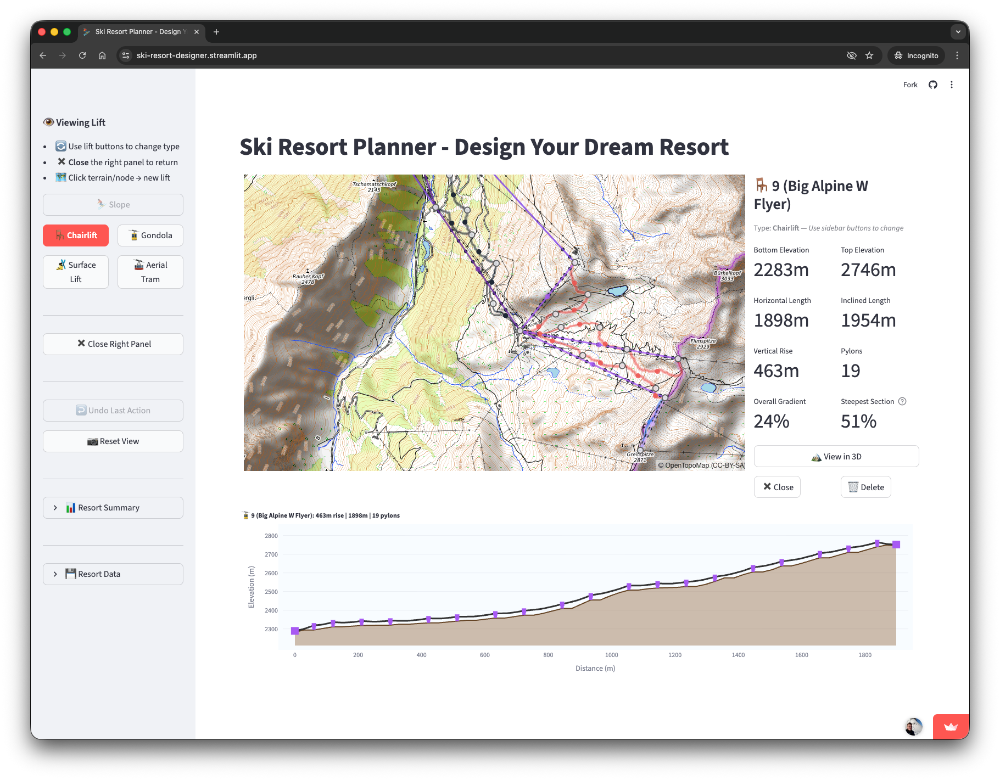
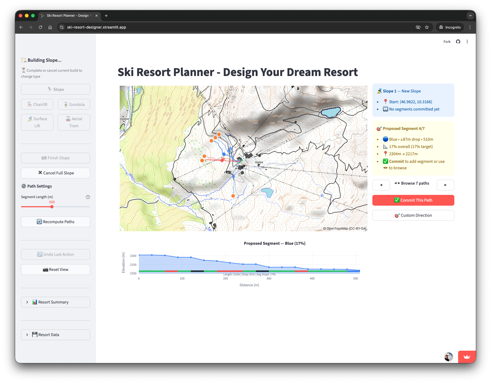
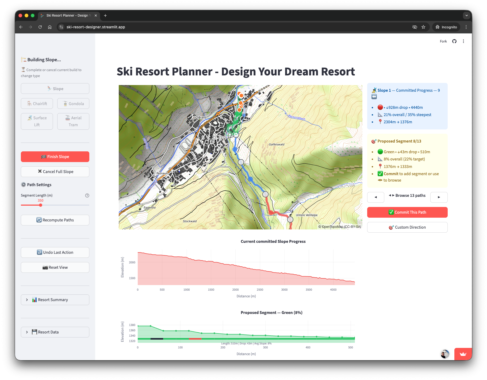
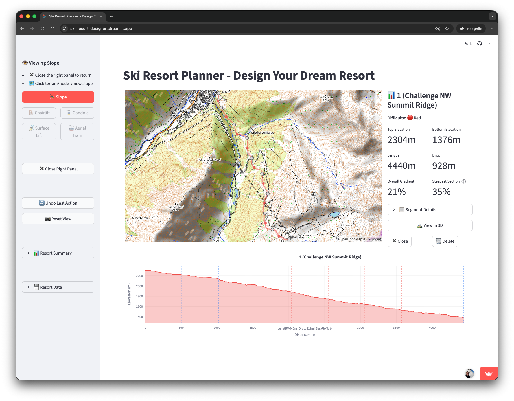
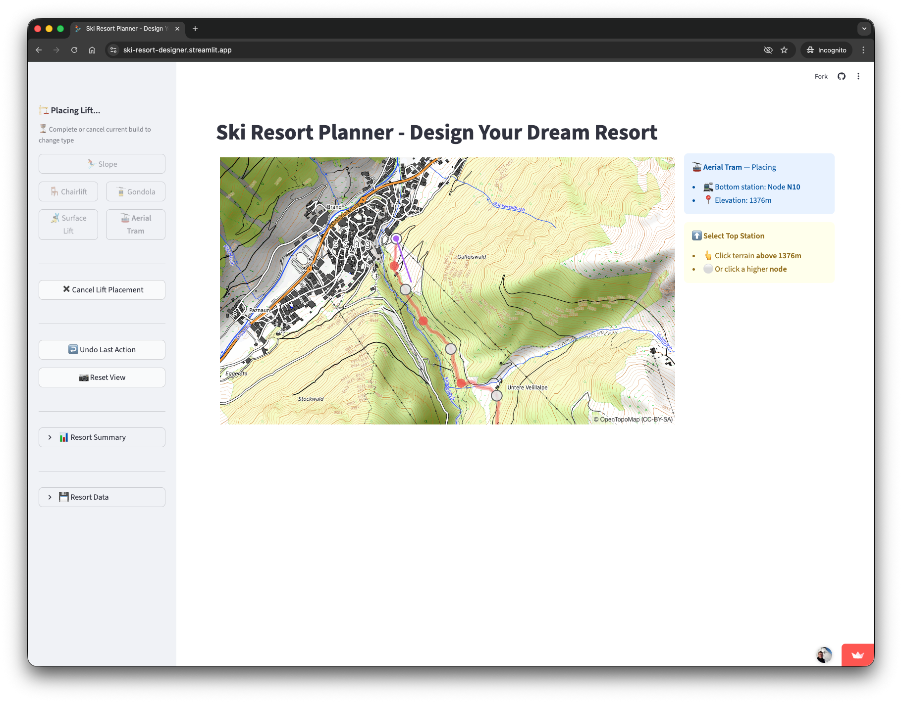
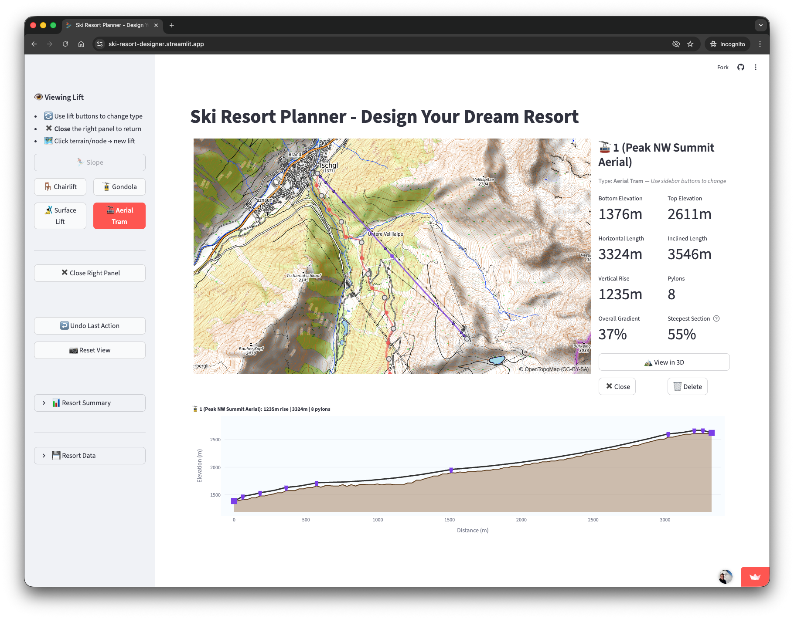
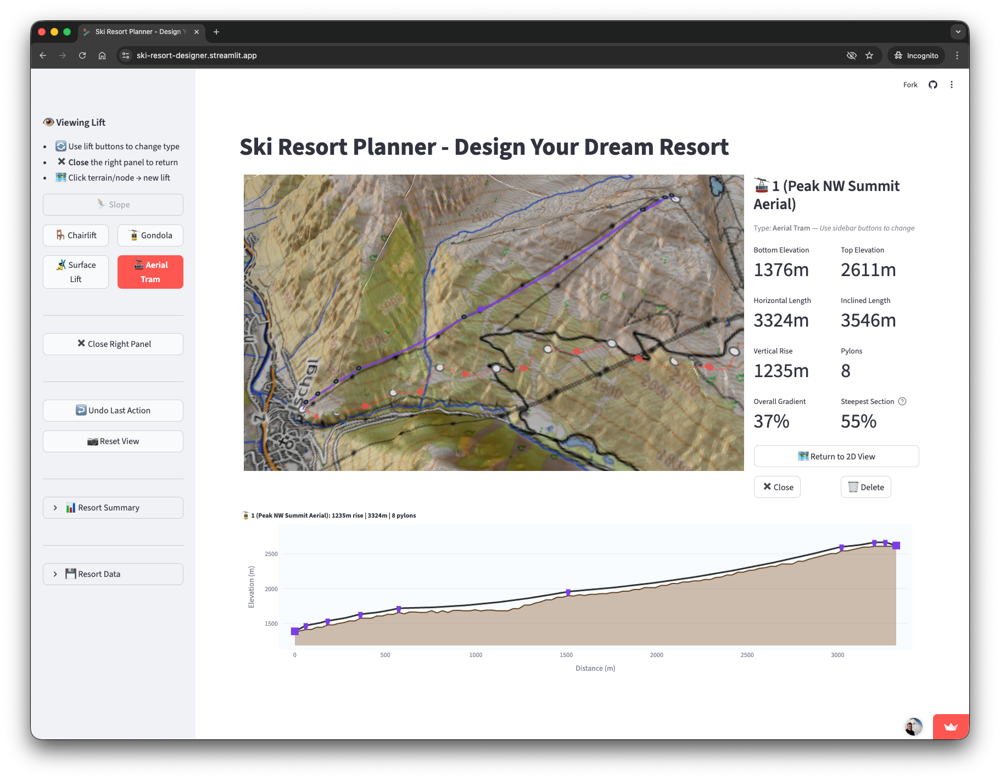
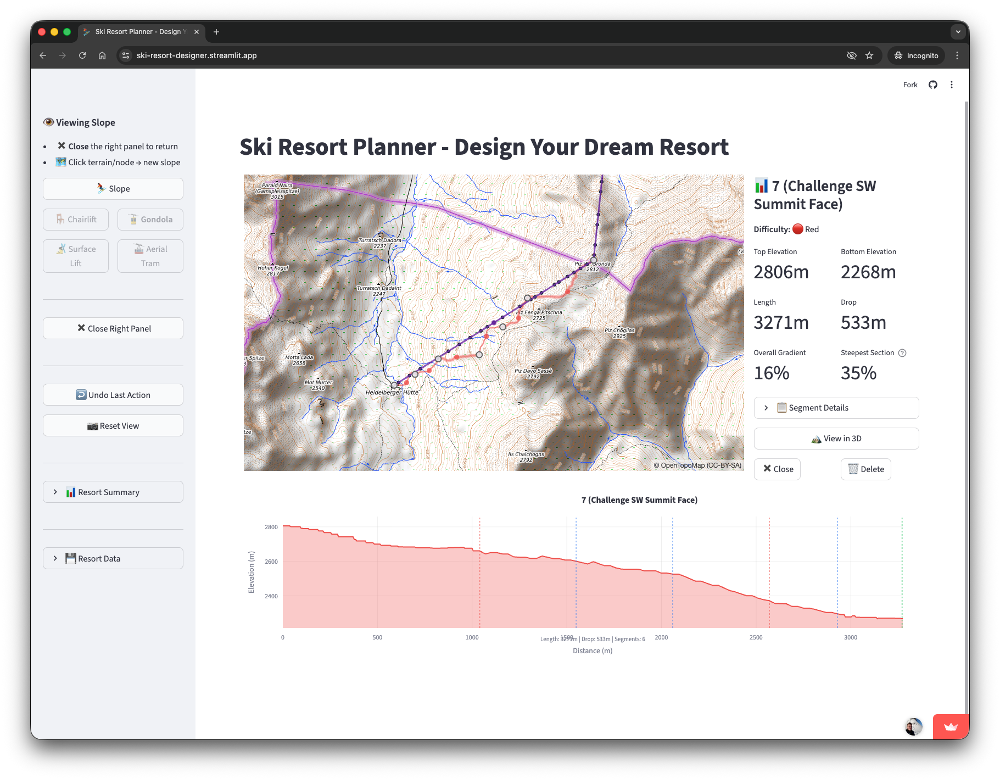

# 🎮 User Guide: Alpin Architect

Design ski resorts on real Alpine terrain with an interactive map-based tool.

> **Technical Reference:** For mathematical details on path generation, traverse physics, and pylon placement algorithms, see [DETAILS.md](DETAILS.md).

---

## Quick Start

1. **Click** on the map to place a starting point → path proposals appear
2. **Click** a dashed line to select it → stats appear in right panel
3. **Click "✅ Commit This Path"** → segment becomes solid, new proposals appear
4. **Click "🏁 Finish Committed Slope"** → slope is complete with a name and difficulty rating

---

## Interface Overview

The interface has three main areas:

| Area | Purpose |
|------|---------|
| **Sidebar (Left)** | Build mode selector, controls, resort stats, save/load |
| **Map (Center)** | Interactive 3D terrain with slopes, lifts, and nodes |
| **Control Panel (Right)** | Path selection, statistics, commit/finish actions |

### Map Elements

| Element | Appearance | Meaning |
|---------|------------|---------|
| **Proposed paths** | Dashed colored lines | Uncommitted path options to choose from |
| **Selected path** | Bold dashed line | Currently highlighted proposal |
| **Committed segments** | Solid colored ribbons | Finalized slope sections |
| **Nodes** | White circles | Junction points (click to start here) |
| **Proposal endpoints** | Orange circles | Click to commit selected path |
| **Lifts** | Purple lines with pylon markers | Ski lifts connecting nodes |
| **Orientation arrows** | Gray arrows | Fall line direction at selection point |

---

### Resort Summary

The sidebar's **📊 Resort Summary** expander gives a whole-resort overview:

- **Counts** — total slopes, lifts, and roads, plus two connectivity badges.
- **Elevation range** across all nodes.
- **Slopes** — total drop and length, the difficulty breakdown (km per green/blue/red/black), and the Greatest descent (max vertical drop).
- **Lifts** — total rise and length, and a per-type count.
- **Roads** — total length and elevation change.

## Building Slopes

### Step 1: Start a New Slope

1. Ensure **⛷️ Slope** is selected in the sidebar (highlighted button)
2. Navigate to your desired starting location (pan/zoom the map)
3. **Click on terrain** or an existing **white node** to start
4. Multiple colored path proposals radiate outward from your click

### Step 2: Select and Review a Path

The right panel shows proposal statistics:

| Stat | Description |
|------|-------------|
| **Difficulty** | Color-coded rating based on steepest section |
| **Gradient** | Average slope percentage |
| **Length** | Horizontal distance in meters |
| **Drop** | Vertical descent in meters |
| **Warnings** | Construction alerts (excavation needed, too flat) |

Use the **◀ ▶ arrows** to browse all available paths sorted left-to-right relative to the fall line.

### Step 3: Commit the Path

Two ways to commit:
- Click **"✅ Commit This Path"** button in the right panel
- Click the **orange endpoint marker** directly on the map

The path becomes a solid ribbon, and new proposals appear from the endpoint.

### Step 4: Continue Building

Repeat steps 2-3 to add more segments. The right panel shows cumulative stats:
- Total segments committed
- Current difficulty (based on steepest segment)
- Total drop and length so far

### Step 5: Finish the Slope

Click **"🏁 Finish Committed Slope"** in the sidebar when done.

- The slope receives an auto-generated name
- Final difficulty = the steepest segment's rating
- All segments are unified under one slope entity

---

## Viewing Slope Details

Click on any **finished slope** (the colored ribbon or its icon) to open the statistics panel:

| Metric | Description |
|--------|-------------|
| **Top/Bottom Elevation** | Start and end heights |
| **Length** | Total horizontal distance |
| **Drop** | Total vertical descent |
| **Overall Gradient** | Average slope percentage |
| **Steepest Section** | Maximum gradient in any 300m window (determines difficulty) |

Below the metrics, up to two **⚠️ connectivity warnings** may appear:
- **Disconnected from the core area** — the slope/lift can't be reached from the resort's core network at all; connect it via slopes or lifts to clear it.
- **One-way trip** — after taking it, no sequence of slopes and lifts brings you back to ride it again (a dead-end).

Both warnings stay silent until the resort has a core network (at least 5 connected lifts).

Expand **📋 Segment Details** to see the per-segment breakdown with any per-segment warnings.

### 3D View

Click **"🏔️ View in 3D"** to see the slope from an angled perspective with terrain mesh. Click **"🗺️ Return to 2D View"** to go back.

### Actions

- **✏️ Rename** — Give the slope a custom name (opens a dialog; the name persists and survives save/reload)
- **✖️ Close** — Return to build mode
- **🗑️ Delete** — Remove the slope (confirms first, can be undone)

---

## Custom Direction

When the auto-generated fan-out proposals don't go where you want, e.g. for connections to existing nodes, just **click the point you want to reach** exactly like roads:

1. While building a slope, **click anywhere downhill** on the map (or on an existing node)
2. The fan-out proposals are replaced by terrain-adaptive path(s) routed to that point
3. Browse them with the **◀ ▶ arrows**, or click a proposal to select it
4. Click the selected proposal again (or press **✅ Commit This Path**) to commit
5. Click a **different** point to re-target — new proposals are traced to the new point
6. Press **✖️ Cancel Custom Path** (or **✖️ Cancel Connection** when targeting a node) to discard targeting and return to the fan-out proposals

### Connecting to Existing Nodes

If you click **directly on a node marker** (white circle):
- A connection path is generated to that node
- Committing this path **auto-finishes the slope** (creates a junction)

**Constraint:** The target must be **downhill** and within **1000m** of the start point; a click outside that range is refused.

---

## Path Generation Details

### How Many Paths?

Up to 16 paths are generated per click (4 difficulties × 2 steepness variants × 2 directions):

| Difficulty | Target Gradients |
|------------|------------------|
| 🟢 Green | 7% (gentle), 12% (steep) |
| 🔵 Blue | 17% (gentle), 22% (steep) |
| 🔴 Red | 28% (gentle), 37% (steep) |
| ⚫ Black | 45% (gentle), 60% (steep) |

On **flat terrain**, fewer paths appear because left/right variants merge when going straight downhill.

> **Technical:** See [DETAILS.md](DETAILS.md) Section 5 for the traverse physics and path tracing algorithm.

### Warnings Explained

| Warning | Meaning | Action Needed |
|---------|---------|---------------|
| **🚜 Excavator Warning** | Cross-slope requires excavation | Construction work to flatten piste |
| **📐 Too Flat Warning** | Gradient < 5% | Skiers may need to pole; valid for connectors |

> **Technical:** See [DETAILS.md](DETAILS.md) Section 4 for earthwork calculations.

---

## Difficulty Classification

A slope's difficulty is determined by its **steepest 300m section** (European standard):

| Color | Gradient Range | Description |
|-------|----------------|-------------|
| 🟢 Green | < 15% | Beginner — gentle, wide runs |
| 🔵 Blue | 15% – 25% | Intermediate — moderate steepness |
| 🔴 Red | 25% – 40% | Advanced — steep, requires skill |
| ⚫ Black | ≥ 40% | Expert — very steep terrain |

**Important:** The classification is based on **actual terrain gradient**, not your target difficulty. A "Black" target on gentle terrain will produce a Green slope.

---

## Designing Lifts

### Step 1: Select Lift Type

In the sidebar, click one of the lift buttons:

| Icon | Type | Best For |
|------|------|----------|
| 🎿 | **Surface Lift** | Short beginner areas, max ~100m spans |
| 💺 | **Chairlift** | Standard mountain transport, up to ~200m spans |
| 🚡 | **Gondola** | Longer distances, weather protection, up to ~300m spans |
| 🚠 | **Aerial Tram** | Very long spans over difficult terrain |

### Step 2: Place Bottom Station

Click on the map to set the **bottom station**:
- **On an existing node** — reuses that junction point
- **On empty terrain** — creates a new node

A purple marker with an uphill arrow appears.

### Step 3: Place Top Station

Click uphill to set the **top station**:
- Must be **higher elevation** than bottom (lifts go uphill)
- Cannot be the same location as bottom

The lift is created immediately with:
- Auto-generated name
- Calculated pylons based on terrain profile
- Cable catenary curve

### Lift Validation

| Error | Cause | Solution |
|-------|-------|----------|
| "Lift Must Go Uphill" | Top station is lower than bottom | Click a higher location |
| "Same Location" | Clicked same point twice | Click a different location |

---

## Viewing Lift Details

Click on any **lift** (the purple line or its icon) to open the statistics panel:

| Metric | Description |
|--------|-------------|
| **Bottom/Top Elevation** | Station heights |
| **Horizontal Length** | Ground distance |
| **Inclined Length** | Cable distance |
| **Vertical Rise** | Elevation gain |
| **Pylons** | Number of support towers |
| **Steepest Section** | Maximum gradient between pylons |

Below the metrics, the same two **⚠️ connectivity warnings** as slopes may appear.

### Changing Lift Type

While viewing a lift, click a different lift button in the sidebar to **change its type**. This updates the pylon configuration and cable profile. The lift's **name is kept**.

### Renaming

Click **✏️ Rename** to give a lift (or slope or road) a custom name. It persists in saved resorts and survives reloads and lift-type changes.

### 3D View

Click **"🏔️ View in 3D"** to see pylons and cable from an angled perspective.

---

## Building Roads

Roads are **vehicle roads** — access roads and connectors between areas of the resort. Unlike a ski slope, a road may climb, descend, or run flat, but it always stays within a gentle **±15% gradient** so cars can drive it. Roads are drawn as a distinct **brown-orange** ribbon.

Roads are built **segment by segment, just like slopes** — and with the same two ways to route: a **fan** of gentle routes radiates from your current point, **or** you click the exact next point and a route is traced straight to it. You keep extending until you press **🏁 Finish Committed Road**.

### Step 1: Select Road mode

Click the **🛣️ Road** button in the sidebar.

### Step 2: Click the start point

Click the road's **origin** — empty terrain or an existing **junction node** (to branch a road off a slope/lift junction).

### Step 3: Extend segment by segment

A **fan** of gentle route **proposals** radiates from the current road end — some climbing, some descending, one running roughly level — so you can browse outward and pick a good-looking one. Alternatively, click the **next point** the road should reach and route(s) are traced straight to it (7%/12% grades, signed for climb or descent). Either way the proposals are drawn as **translucent-brown** paths; browse them with the **◀ ▶ arrows** in the right panel or by clicking a dashed proposal to highlight it, then press **✅ Commit Road Segment** to commit — the segment turns solid brown and you can extend further. Clicking an existing **node** makes the proposal a **connector**: the button becomes **🏁 Finish → {node}** and committing joins that junction and **finishes the road**.

- If even a **direct** road to your clicked point would exceed **±15%**, **no proposal** is offered and you get a message — a car road there is genuinely impossible, so pick a closer point or route across gentler ground. If a gentle direct line fits, it's offered as a single **bridge/cut** route.
- **Undo** removes the last committed segment (then the one before it), exactly like a slope.

### Step 4: Finish the road

Press **🏁 Finish Committed Road** in the sidebar. The road receives an auto-generated name and its details panel opens. Press **✖️ Cancel Full Road** to discard the whole in-progress road.

### Parking places

Wherever a road **shares a junction with a slope or a lift**, that junction node renders as a **🅿️ bigger blue parking marker** automatically.

### Viewing Road Details

Click any road (its brown line or icon) to open its panel:

| Metric | Description |
|--------|-------------|
| **Start/End Elevation** | Endpoint heights |
| **Length** | Total road length |
| **Average Gradient** | Overall steepness |
| **Elevation Change** | Net rise/fall (signed) |
| **Steepest Section** | Steepest 300m section (magnitude), always ≤15% |

As with slopes and lifts, you can view the road's elevation profile, switch to **🏔️ 3D**, **✏️ Rename** it, **🗑️ Delete** it, or **↩️ Undo**.

---

## Sidebar Controls

### Build Mode Selector

- **⛷️ Slope** — Click terrain to start a new ski slope
- **🛣️ Road** — Build a gentle car road segment by segment
- **🎿💺🚡🚠 Lift buttons** — Click terrain to place a lift (Surface, Chair, Gondola, Aerial Tram)

Below a divider sit two **utility** buttons:

- **🗺️ Import** — load real lifts & pistes from OpenStreetMap for an area.
- **🔗 Node Merge** — merge junction nodes, delete a node, or add a node on a path.

The currently active mode is highlighted.

### During Slope Building

| Control | Action |
|---------|--------|
| **Segment Length Slider** | Adjust path length (100–1000m) |
| **🏁 Finish Committed Slope** | Complete and name the current slope |
| **✖️ Cancel Full Slope** | Discard all uncommitted segments |

### During Lift Placement

| Control | Action |
|---------|--------|
| **✖️ Cancel Lift Placement** | Discard start point, return to idle |

### During Road Building

| Control | Action |
|---------|--------|
| **🏁 Finish Committed Road** | Finalize the road (enabled after ≥1 segment) |
| **✖️ Cancel Full Road** | Discard the whole in-progress road, return to idle |

### During Node Editing

| Control | Action |
|---------|--------|
| **🔗 Confirm Merge** | Collapse the selected nodes to their median (enabled at ≥2) |
| **🗑️ Delete Node(s)** | Delete the selected interior / end nodes (enabled at ≥1) |
| **✖️ Cancel Merge** | Clear the selection, return to idle |

### Search for a Place

In the **Always Available** controls (alongside Undo and Reset View) is a 🔍 search field. Type a
place name — a ski resort, a town, a mountain, anything OpenStreetMap knows — and press **Enter**
(or click the **🔍** button). The map jumps to the best match. If nothing is found you get a
**"No place found"** notice and the map stays put.

### Always Available

| Control | Action |
|---------|--------|
| **🔍 Search** | Type a place name + Enter to center the map on it |
| **↩️ Undo Last Action** | Reverse the most recent change |
| **📷 Reset View** | Return camera to default position |

---

## Resort Statistics

The sidebar shows cumulative stats:

| Stat | Description |
|------|-------------|
| **Slopes** | Total count by difficulty |
| **Total Drop** | Sum of all vertical descent |
| **Total Length** | Sum of all slope lengths |
| **Lifts** | Total count by type |

---

## Save and Load

Save and load live under the **💾 Resort Data** expander in the sidebar.

### Saving Your Resort

Click **💾 Save to File** to download a JSON file containing:
- All slopes with segments and waypoints
- All lifts with pylon positions
- Node connections

### Loading a Resort

Click **📂 Load from File** and select a previously saved JSON file.

### Export GPX

Click **📥 Export GPX** to download GPS tracks of your slopes for use in other applications.

---

## Import from OpenStreetMap

Instead of starting from an empty map, load a real resort's existing lifts and pistes as a
canvas, then keep editing with the normal tools.

1. Select **🗺️ Import** in the build-mode selector (like picking Slope/Road/Lift).
2. Adjust the **Import area half-width (km)** slider (left) to size the box.
3. **Click the map** to drop the import area — a blue square + center dot appear where you clicked. Click elsewhere to re-place it; move the slider to resize it live.
4. **Confirm** by clicking the **center dot** on the map, or the **✅ Confirm Import** button in the right panel. The lifts and pistes fully inside the square are then fetched and added. **✖️ Cancel Import** (left) discards the box.

**What gets imported**

- **Pistes:** only alpine downhill runs. Their colour (difficulty) is computed from the terrain, not copied from OSM.
- **Lifts:** drag/T-bar → surface lift, chairlift → chairlift, gondola/mixed (incl. 3S and Funitel gondolas) → gondola, cable car → aerial tram. Everything else — stations, pylons, zip-lines, kiddie lifts (magic carpets, rope tows), funiculars — is ignored. Pylons are placed by the terrain, not taken from OSM.

**Good to know**

- **Only named runs import.** Unnamed lifts and pistes are skipped — in OSM they're frequently outdated or duplicate.
- **Only runs fully inside the area import.** A piste or lift that reaches outside the box is skipped entirely (never half-imported) — enlarge the area or re-center and re-import to get it whole.
- **Trivial runs are ignored.** Lifts shorter than 300 m and pistes shorter than 200 m are skipped.
- **Re-importing won't duplicate.** If you import an overlapping area again, runs already in the resort are recognised and skipped.
- **One Undo removes the whole import**, so you can undo and import a different area.

---

## Editing Nodes

Slopes, roads, and lifts all meet at **nodes** (the junction markers on the map). The **🔗 Node Merge** utility is where you clean those up. Select **🔗 Node Merge** in the build-mode selector to enter it.

### Merge nodes into one

Use this when several junctions that should be one point sit slightly apart (common right after an OpenStreetMap import, where a station splits into a cluster).

1. **Click node markers** to select them (click a selected node again to deselect). Selected nodes are highlighted, and the right panel shows the count and the **span** (largest gap between any two).
2. Click **🔗 Confirm Merge**. The selected nodes collapse to their **median position**, every slope/road/lift attached to them is repointed onto the survivor.

### Delete a node

1. Select **one or more** node markers.
2. Click **🗑️ Delete Node(s)**.

Only nodes that can be removed cleanly are deleted:

- An **interior node** of a path — its two segments fuse into one.
- A **clean endpoint** of a path with more than one segment — its end segment is trimmed off and the rest of the path is kept.

Deletion is **refused with a message** when a selected node is:

- a **lift station** — delete the lift first;
- a **junction shared with another path** — delete that path first;
- the **only segment of its path** — delete the whole path instead.

### Add a node on a path

While in Node Merge mode, **click anywhere on an existing path** to drop a new node on the centerline at that point, splitting the segment in two. Use this to create a junction to branch a new slope or road off later.

---

## Exploring New Areas

### Navigation

| Action | How |
|--------|-----|
| **Search** | Type a place name in the 🔍 sidebar field + Enter |
| **Pan** | Click + drag the map |
| **Zoom** | Mouse wheel or pinch |
| **Reset View** | Click 📷 button in sidebar |

> **Tip:** The fastest way to reach a real resort is the **🔍 search** at the top of the sidebar —
> type e.g. "Zermatt" and press Enter instead of panning there by hand.

---

## Tips for Good Designs

### Slope Design

- **3-6 segments** per slope works well (300-800m vertical)
- Mix difficulties by varying traverse angles
- Click an existing **node** to connect slopes at junctions

### Lift Design

- Place lifts from **valley to summit** (uphill direction)
- Connect lift top stations to slope start points
- Use **Gondolas** for long distances or exposed terrain

### Resort Layout

- Create a network with **multiple ways down**
- Connect slopes at **nodes** for flexibility
- Plan lift capacity to match slope throughput

---

## Keyboard Reference

| Action | Input |
|--------|-------|
| Search a place | Type in 🔍 field + Enter |
| Pan map | Click + drag |
| Zoom in/out | Mouse wheel |
| Start slope | Click terrain (Slope mode) |
| Select path | Click dashed line |
| Commit path | Click orange endpoint or Commit button |
| Start from node | Click white circle |
| Place lift station | Click terrain (Lift mode) |

---
